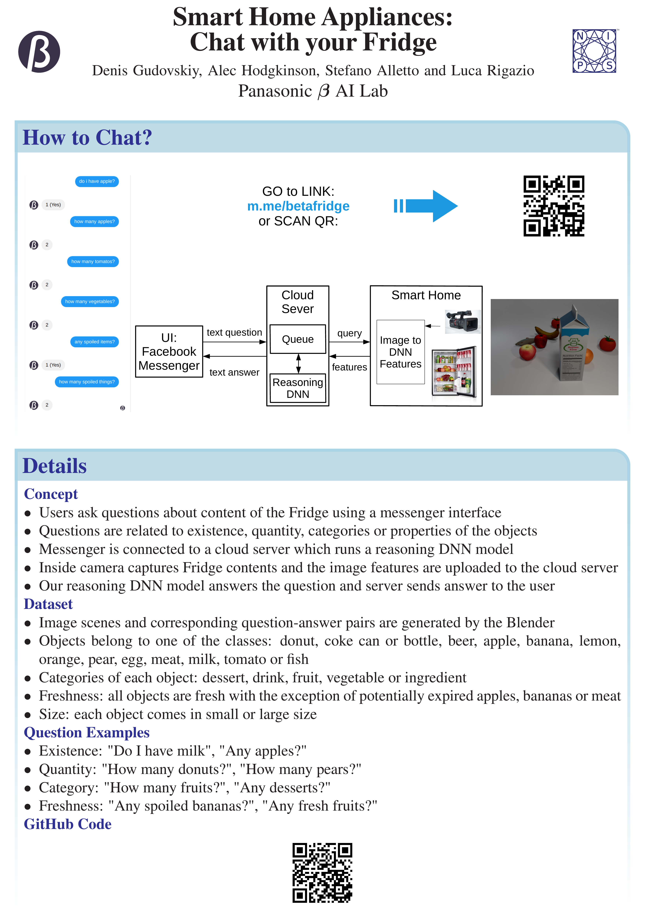

# Facebook chatbot
Facebook app has to be set up according to the official documentation [Facebook for Developers](https://developers.facebook.com/docs/messenger-platform/).

# Heroku cloud
Heroku cloud server has to be set up according to the official documentation [Getting Started on Heroku](https://devcenter.heroku.com/start).
We provide `app.js` script that can be run on Heroku server to work with Facebook server. On the client side, this script pushes user requests into AMQP queue.

# To start demo execute command
This script reads AMQP data and executes the trained reasoning model:

```bash
CUDA_VISIBLE_DEVICES=0, python3 rpc_server.py --expName fridgr_FeatCls_EmbRandom_CfgArgs0 --gpus 0 --netLength 4 --restoreEpoch 25 --getPreds @configs/args_inference.txt
```

# Environment variables
Don't forget to set up queue and Facebook chatbot variables in `app.js`:
```bash
CLOUDAMQP_URL
PAGE_ACCESS_TOKEN
VERIFICATION_TOKEN
```

# GitHubs for FRIDGR dataset and reasoning model
[FRIDGR Dataset](https://github.com/gudovskiy/fridge-dataset/) and [Fridge Model](https://github.com/gudovskiy/fridge-model)

# BibTeX citation
```bash
@article{chat-fridge,
	author = {Denis Gudovskiy and Gyuri Han and Takuya Yamaguchi and Sotaro Tsukizawa},
	journal = {arXiv preprint arXiv:1912.?????},
	title = {Smart Home Appliances: Chat with Your Fridge},
	year = {2019}
}
```

# Demo video
[](https://www.youtube.com/watch?v=UkapMNcXlq8)

# NeurIPS 2019 Poster
<div align="center">
  
</div>
